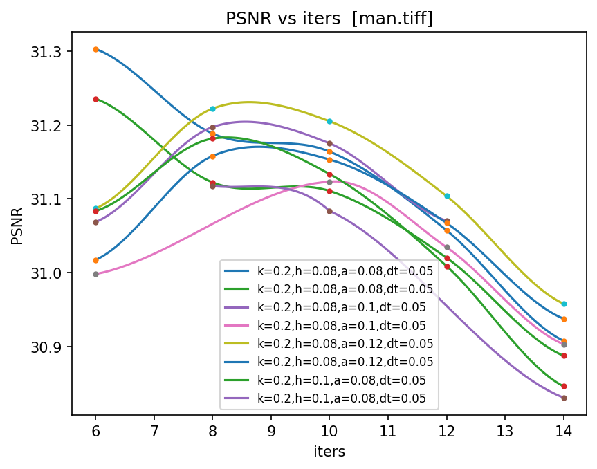
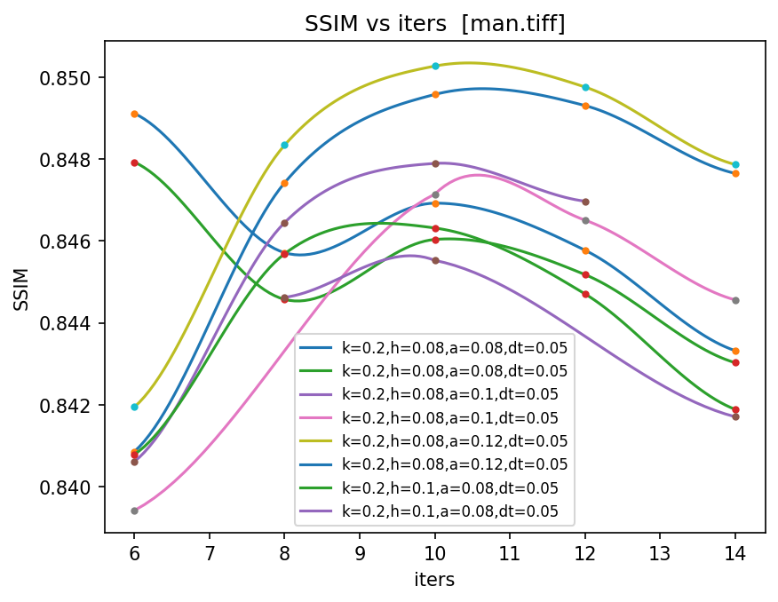
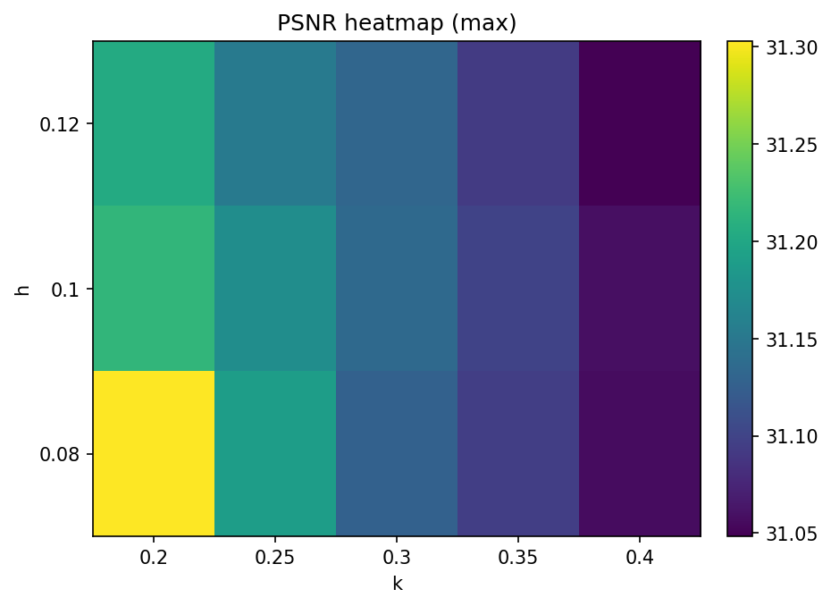
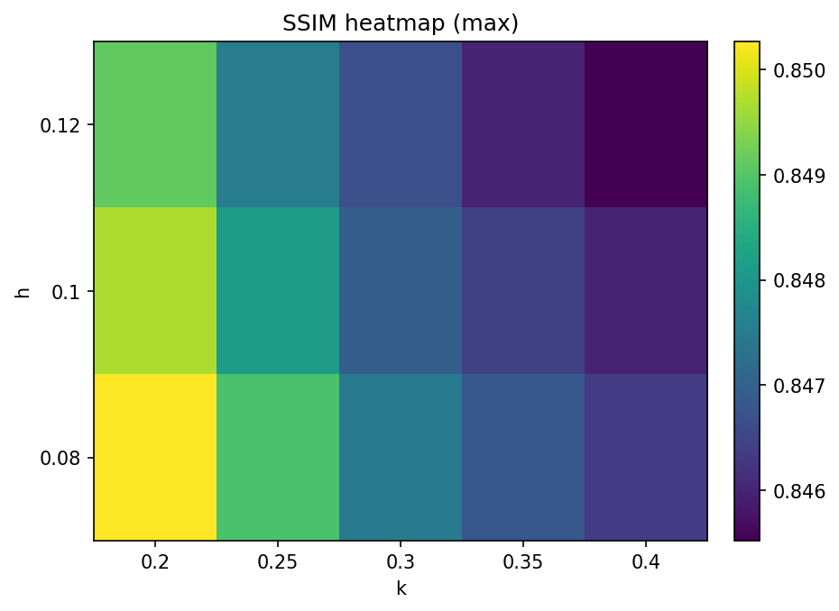
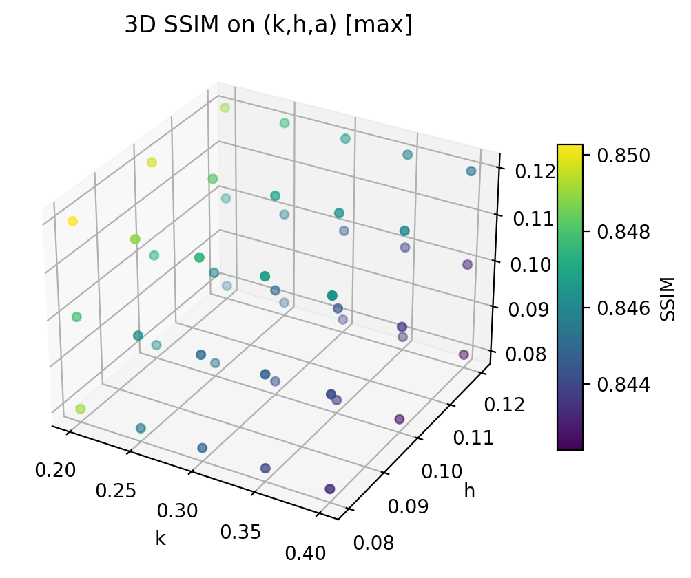
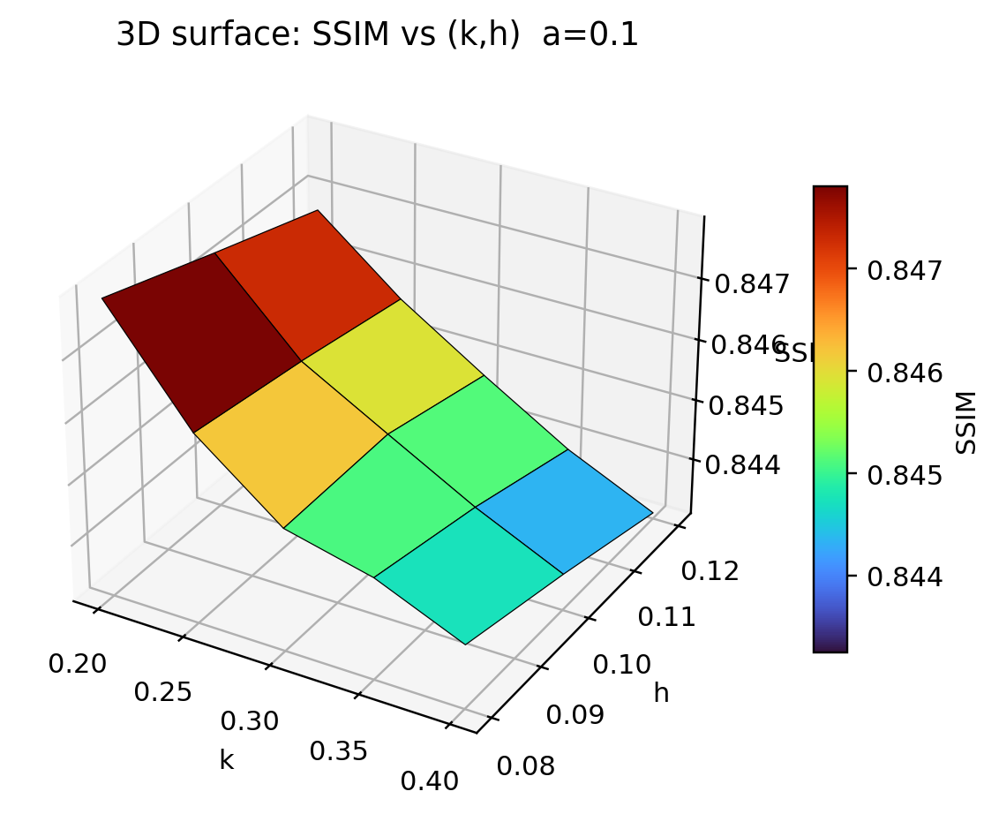

# OHG-AD — Oriented Half-Gaussian Kernels & Anisotropic Diffusion

> Reproducible, modular, experiment-friendly implementation with CLI tools, hyper-parameter sweeps, aggregation, and publication-ready plots.

---

## 目录 · Table of Contents
- [1) 项目简介 · What is this?](#1-项目简介--what-is-this)
- [2) 安装与准备 · Install & Setup](#2-安装与准备--install--setup)
- [3) 目录结构 · Repository Layout](#3-目录结构--repository-layout)
- [4) 项目实验指南 & 结果展示](#4-项目实验指南--结果展示--experiments--results-man--barbara)
  - [4.1 单图实验：`scripts/run_single.py`](#41-单图实验scriptsrun_singlepy)
  - [4.2 批量网格搜索：`scripts/run_sweep.py`](#42-批量网格搜索scriptsrun_sweeppy)
  - [4.3 结果聚合：`scripts/aggregate_results.py`（可选）](#43-结果聚合scriptsaggregate_resultspy可选)
  - [4.4 图表生成：`scripts/make_plots.py`](#44-图表生成scriptsmake_plotspy)
- [5) 在 README 中插入图片 · How to insert images](#5-在-readme-中插入图片--how-to-insert-images)
- [6) 常见问题 · FAQ](#6-常见问题--faq)
- [7) 许可证与引用 · License & Citation](#7-许可证与引用--license--citation)
- [8) 贡献 · Contributing](#8-贡献--contributing)

---

## 1) 项目简介 · What is this?

**OHG-AD** 是一套围绕“方向半高斯核 + 各向异性扩散”的**图像去噪研究与复现实验**代码库。它具有：

- **模块化核心实现**（PyTorch），便于阅读与修改；
- **完整的命令行工具链**：单图实验 / 自动选择迭代步数 / 批量网格搜索（sweep）；
- **结果标准化与可视化**：PSNR/SSIM 指标、曲线、热图、3D 散点与 3D 曲面）；
- **可复现的目录/日志结构**，直接用于论文指标复现与图表生成。

> 说明：本 README 暂时去除了数学公式推导，聚焦于复现实验与工程化使用。

---

## 2) 安装与准备 · Install & Setup

```bash
# 建议 Python 3.9+；CUDA 可选（若不可用会自动回落 CPU）
git clone https://github.com/nkqzh/-OHG_AD-Oriented-Half-Gaussian-Kernels-and-Anisotropic-Diffusion-Implementation
cd -OHG_AD-Oriented-Half-Gaussian-Kernels-and-Anisotropic-Diffusion-Implementation
python -m pip install -e .
```

- **数据**：将示例数据放入 `data/USC_SIPI/`（如 `man.tiff`, `barbara.bmp`, `lena.tiff`）。
- **Windows**：PowerShell 中含逗号的参数请用引号包裹，如 `--plots "curves,heatmap,3d,surface"`。
- **设备**：`--device cuda` 时自动回退为 CPU（当 CUDA 不可用）。

---

## 3) 目录结构 · Repository Layout

```text
codes/
  algorithms/
    ohg_ad.py             # 高层封装：I/O、denoise 入口、run_once、指标计算与写盘
  core/                   # 核心算法原子模块（尽量小而清晰）
    params.py             # OHGADParams: k/h/a/μ/λ/Δθ/dt/iters 等参数
    kernels.py            # 方向“半高斯导数”核的生成与缓存
    orientation.py        # 方向能量扫描 Q、极值角 θ1/θ2、直化角 γ 与 ρ1/ρ2
    operators.py          # 反射边界卷积；I_xx/I_yy/I_xy 与任意方向二阶导 I_{θθ}
    diffusion.py          # 单步扩散与完整去噪循环（显式欧拉；夹紧到[0,1]）
    metrics.py            # 指标包装（PSNR/SSIM）
  runners/
    single.py             # 单次实验 & 自动 iters 搜索（早停；保存 best.json）
    sweep.py              # 从 YAML 读取网格；安全追加 metrics.jsonl；输出 runs/ 子目录
  viz/
    plot_curves.py        # PSNR/SSIM vs iters（样条平滑+采样点）
    plot_heatmap.py       # 任意两参数网格热图（max/mean 聚合）
    plot_3d.py            # k–h–a 3D 散点，颜色映射指标（支持 --show）
    plot_surface.py       # (k,h)→指标 的 3D 曲面（固定 a；cmap+colorbar+vclip）
configs/
  sweeps/
    man_sigma10.yaml          # Man：σ=10 粗扫
    man_sigma10_refine.yaml   # Man：σ=10 精扫（围绕高分区）
    barbara_sigma20.yaml      # Barbara：σ=20 粗扫
    barbara_sigma20_refine.yaml
scripts/
  run_single.py           # 单图/自动 iters 的 CLI 包装（可直跑，或经 pip 安装后使用）
  run_sweep.py            # 批量 sweep 的 CLI 包装
  make_plots.py           # 曲线/热图/3D/曲面 的统一入口（支持 --show）
  aggregate_results.py    # 聚合多个 jsonl → CSV/JSON（可选）
data/                     # 放置原始/官方示例数据（不纳入版本控制）
results/                  # 所有实验输出的根目录（可自定义）
  sweeps/<exp>/           # 每次 sweep 的“实验根”
    metrics.jsonl         # 顶层汇总日志（逐行）
    best.json             # 依据 ref_metric 的最优记录
    config.used.yaml      # 本次使用的配置快照
    runs/                 # ★ 每个参数组合一个子目录，避免顶层文件爆炸
      k0.3__h0.1__a0.1__mu5__lam1__dt0.05__it8/
        man_noisy.png
        man_den_ohgad.png
        report.json       # 本组合所有细节（含路径、指标）
        metrics.jsonl     # 本组合的单行指标
docs/                     # 可选：说明/示例图片（供 README 引用）
```

> 说明：`runs/` 的目录名为**参数摘要**（保留合理小数），便于检索与复现。顶层仅保留 `metrics.jsonl / best.json / config.used.yaml`。

---

## 4) 项目实验指南 & 结果展示 · Experiments & Results (Man / Barbara)

> 本节覆盖**所有官方脚本**的**用途、参数说明与示例命令**。  
> 样例图片使用 USC-SIPI：`man.tiff`（σ=10）与 `barbara.bmp`（σ=20）。  
> **临时文本指标**仅作占位（后续请替换为最新图片或数值）。

### 4.1 单图实验：`scripts/run_single.py`

**用途**  
单次去噪实验；或启用 `--auto-iters` 自动搜索最佳迭代步数（早停机制）。

**主要参数**
- `--input`：输入图片路径（支持灰度/彩色，内部自动转灰度）。
- `--gt`：真值图片路径；若 `--sigma > 0`，会对 `input` 加噪并以其**自身**作为 `gt`。
- `--sigma`：加性高斯噪声强度（像素 0–255 标度）。
- `--k --h --a --mu --lam --dtheta --dt --iters`：算法参数（建议从提供的 sweep 配置起步）。
- `--device`：`cuda` 或 `cpu`（默认 `cuda`，不可用时回退 `cpu`）。
- `--out`：输出目录。
- `--auto-iters`：启用自动选择迭代步数；配合：
  - `--iters-max`：最大迭代步（默认 30）。
  - `--patience`：早停耐心（连续无提升若干次后停止）。
  - `--ref`：参考指标 `psnr` / `ssim`（默认 `psnr`）。

**输出**
- 图片：`<out>/<stem>_noisy.png`, `<stem>_den_ohgad.png`
- 指标：`report.json`（本次完整信息）、`metrics.jsonl`（可累计汇总）
- 控制台：打印简要 JSON 摘要

**示例 · Man（σ=10）**
```bash
python scripts/run_single.py \
  --input data/USC_SIPI/man.tiff --gt data/USC_SIPI/man.tiff \
  --sigma 10 --dtheta 2 --dt 0.05 --iters 8 \
  --mu 5 --lam 1 --k 0.3 --h 0.1 --a 0.1 \
  --out results/man_sigma10_run
```

**指标**
- **Man σ=10 →** `PSNR ≈ 31.19`, `SSIM ≈ 0.854`

**示例 · Barbara（σ=20）**
```bash
python scripts/run_single.py \
  --input data/USC_SIPI/barbara.bmp --gt data/USC_SIPI/barbara.bmp \
  --sigma 20 --dtheta 2 --dt 0.05 --iters 12 \
  --mu 5 --lam 1 --k 0.3 --h 0.1 --a 0.2 \
  --out results/barbara_sigma20_run
```

**临时文本指标（占位）**
- **Barbara σ=20 →** `PSNR ≈ 23.01`, `SSIM ≈ 0.683`

**示例 · 自动迭代选择（有 GT，按 SSIM 早停）**
```bash
# Man-10
python scripts/run_single.py \
  --input data/USC_SIPI/man.tiff --gt data/USC_SIPI/man.tiff \
  --sigma 10 --auto-iters --iters-max 30 --patience 3 --ref ssim \
  --dt 0.05 --mu 5 --lam 1 --k 0.3 --h 0.1 --a 0.1 \
  --out results/man_sigma10_autoiters

# Barbara-20
python scripts/run_single.py \
  --input data/USC_SIPI/barbara.bmp --gt data/USC_SIPI/barbara.bmp \
  --sigma 20 --auto-iters --iters-max 30 --patience 3 --ref ssim \
  --dt 0.05 --mu 5 --lam 1.2 --k 0.35 --h 0.11 --a 0.22 \
  --out results/barbara_sigma20_autoiters
```

---

### 4.2 批量网格搜索：`scripts/run_sweep.py`

**用途**  
从 YAML 读取搜索空间，批量运行所有参数组合；顶层生成 `metrics.jsonl / best.json / config.used.yaml`，各组合输出归档到 `<out>/runs/<参数摘要>/`（避免顶层文件过多）。

**YAML 配置结构（示例）**
```yaml
dataset:
  images: [data/USC_SIPI/man.tiff]  # 可放多图
  sigma: 10
defaults:
  device: cuda
  dtheta: 2.0
  dt: 0.05
  iters: 10
  mu: 5.0
  lam: 1.0
search:
  k: [0.20, 0.25, 0.30, 0.35, 0.40]
  h: [0.08, 0.10, 0.12]
  a: [0.08, 0.10, 0.12]
  dt: [0.04, 0.05]
  iters: [6, 8, 10, 12, 14]
ref_metric: ssim
runs_dir: runs
```

**示例 · Man（σ=10）粗扫**
```bash
python scripts/run_sweep.py \
  --config configs/sweeps/man_sigma10.yaml \
  --out results/sweeps/man_sigma10
```

**示例 · Barbara（σ=20）粗扫**
```bash
python scripts/run_sweep.py \
  --config configs/sweeps/barbara_sigma20.yaml \
  --out results/sweeps/barbara_sigma20
```

**示例 · 精扫（围绕粗扫高分区）**
```bash
python scripts/run_sweep.py \
  --config configs/sweeps/man_sigma10_refine.yaml \
  --out results/sweeps/man_sigma10_refine

python scripts/run_sweep.py \
  --config configs/sweeps/barbara_sigma20_refine.yaml \
  --out results/sweeps/barbara_sigma20_refine
```

**指标**
- **Man 粗扫 top-1 →** `SSIM ≈ 0.85, PSNR ≈ 31.20`（`k=0.2, h=0.08, a=0.12, dt=0.05, it=10`）  

---

### 4.3 结果聚合：`scripts/aggregate_results.py`（可选）

**用途**  
把一个或多个 `metrics*.jsonl` 汇总为 CSV/JSON，并可生成**复合分**（例如 `score = 0.7*SSIM + 0.3*PSNR_norm`），方便快速挑选最优。

**主要参数**
- `--logs`：glob 或多个路径（空格分隔）。
- `--out`：输出目录。
- `--alpha --beta`：复合分权重（默认 `0.7/0.3`）。
- `--order`：排序键（`score/psnr/ssim`）。

**示例 · Man（σ=10）**
```bash
python scripts/aggregate_results.py \
  --logs results/sweeps/man_sigma10/metrics*.jsonl \
  --out  results/sweeps/man_sigma10/aggregate \
  --order score --alpha 0.7 --beta 0.3
```

**输出**
- `summary.csv`：所有行汇总  
- `topk.csv`：Top-K 概览  
- `best_overall.json`：全局最优  
- `best_by_image.json`：按图像最优

**指标**
- `best_overall.score ≈ 0.894`

---

### 4.4 图表生成：`scripts/make_plots.py`

**用途**  
从 `metrics.jsonl` 生成**曲线 / 热图 / 3D 散点 / 3D 曲面**（论文风格，带色条；支持色域裁剪）。

**主要参数**
- `--plots`：要生成的图表类型，逗号分隔：`curves,heatmap,3d,surface`  
  > Windows/Pwsh：请用引号包裹：`--plots "curves,heatmap,3d,surface"`
- `--metrics`：要绘制的指标，逗号分隔：`psnr,ssim`
- `--x`：曲线横轴（通常 `iters`）
- `--grid`：热图网格（如 `k,h` 或 `k,a`）
- `--reduce`：重复格点聚合策略（`max` / `mean`）
- `--img`：3D 散点仅绘某张图（可选，默认聚合全部）
- `--a`：3D 曲面固定的 a 值（如 `0.1` 或 `0.2`）
- `--cmap --vmin --vmax --vclip`：曲面配色与色域（如 `--cmap turbo --vclip 1,99`）
- `--show`：显示交互窗口（关闭窗口后返回）
- `--out`：输出目录；`--verbose`：打印详细过程

**示例 · Man（σ=10）**
```bash
python scripts/make_plots.py \
  --log   results/sweeps/man_sigma10/metrics.jsonl \
  --plots "curves,heatmap,3d,surface" \
  --metrics psnr,ssim --x iters --grid k,h --reduce max \
  --a 0.1 --vclip 1,99 --cmap turbo \
  --out   results/sweeps/man_sigma10/plots --verbose
```

**示例 · Barbara（σ=20）**
```bash
python scripts/make_plots.py \
  --log   results/sweeps/barbara_sigma20/metrics.jsonl \
  --plots "curves,heatmap,3d,surface" \
  --metrics psnr,ssim --x iters --grid k,a --reduce max \
  --a 0.2 --vclip 1,99 --cmap turbo \
  --out   results/sweeps/barbara_sigma20/plots --verbose
```

**结果 · Man（σ=10）**
<p align="center">
  
  
  
</p>
<p align="center">

  

</p>
<p align="center">
  
  
</p>

---


## 5) 常见问题 · FAQ

- **导入失败/找不到包**：确保顶层包为 `codes/` 且含 `__init__.py`；脚本内置 bootstrap，可不安装直接运行；可选 `pip install -e .`。  
- **Windows 写文件失败（PermissionError）**：`metrics.jsonl` 可能被占用或被误建为**文件夹**；sweep 已内建**安全追加与自动回退**。关闭占用程序或重试运行 `--out`。  
- **3D 图未生成**：请给 `--plots "...,3d,..."` 加引号；或确认日志包含 `k/h/a` 三键。无数据时脚本会生成“占位图”并打印原因。  
- **速度与稳定**：`dtheta=2°` 足够；更小会显著增时且收益有限。优先调 `iters` 与 `a/lam`。

---

## 6) 许可证与引用 · License & Citation

- 许可证：MIT（见 `LICENSE`）  
- 引用：见 `CITATION.cff`（学术使用请注明项目地址与所基于论文）

---

## 7) 贡献 · Contributing

欢迎 PR（新增数据配置、可视化方式、评测脚本、稳定性改进等）。  
建议先运行基本 **smoke test**（见 `.github/workflows/ci.yml`）并保持**双语注释**。

---

**Let’s build great open-source together!**
